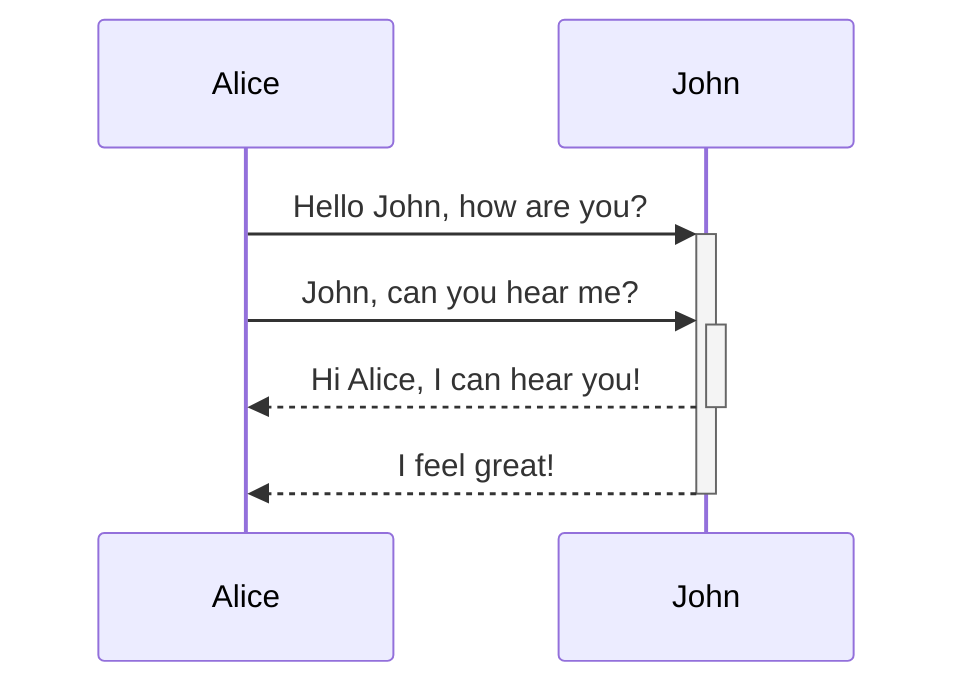
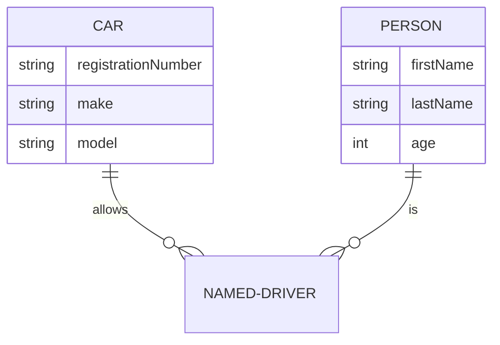
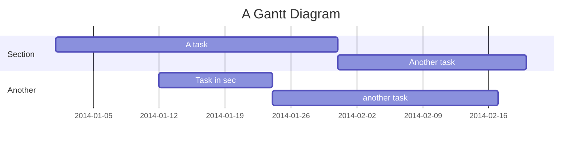

# Mermaid 学习

## 流程图范例

```mermaid
graph TD
    A-->B
    A-->C
    B-->D
    C-->D
```

# 序列图

```mermaid
sequenceDiagram
    Alice->>+John: Hello John, how are you?
    Alice->>+John: John, can you hear me?
    John-->>-Alice: Hi Alice, I can hear you!
    John-->>-Alice: I feel great!
```
# er图

```mermaid

erDiagram  
    CAR ||--o{ NAMED-DRIVER : allows  
    CAR {  
        string registrationNumber  
        string make  
        string model  
    }  
    PERSON ||--o{ NAMED-DRIVER : is  
    PERSON {  
        string firstName  
        string lastName  
        int age  
    }
```

# Gantt

```mermaid
gantt
    title A Gantt Diagram
    dateFormat  YYYY-MM-DD
    section Section
    A task           :a1, 2014-01-01, 30d
    Another task     :after a1  , 20d
    section Another
    Task in sec      :2014-01-12  , 12d
    another task      : 24d
```