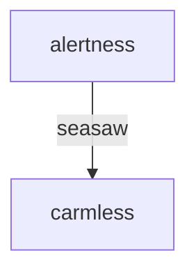

## 神经科学

- sensation: 感觉
    - 感觉器官收到的外界信号

- perception: 感知
    - 感知是将注意力的聚光灯投射到某一部分感觉上

- emotion/feeling: 情绪
    - happiness, sadness, boredom, frustration

- thoughs: 
    - 回忆过去，设想未来

- actions:

电信号， 化学物质

### 化学物质

- dopamine

- serotonin: 血清素
    - 使我们对自己拥有的东西感到满足

- acetylcholine: 乙酰胆碱
    - 产生强烈的聚光灯效果

- epinephrine: 肾上腺素
- adrenaline: 肾上腺素
    紧张，不安

- norepinephrine: 去甲肾上腺素
    神经调节剂

### 化学物质的receptor 受体

### 调节机制

- 神经调节器可以让某些神经元活跃，某些神经元平静

### 控制模式

- 自下而上

- 自上而下
    - deliberate
    - DPO (duration/path/outcome)

limbic system
frontal cortex

### nerual plasticity

- 哪些方面可以被改变, sensation, perception, emotion, 
- 如何改变, 结构是什么

神经的塑造是在睡眠和非睡眠深度休息时发生的

-- 高强度困难工作后，立即刻意休息20分钟，可以加速神经塑造

-- 深度睡眠中，如果听到了白天的背景声音，会加速学习过程

### 转换过程

- 掌握好睡眠和清醒之间的转换

seesaw

autonomic nervous system 
自主神经系统

### rhythms

- circadian rhythms
- ultradian rhythms
    90 minutes

